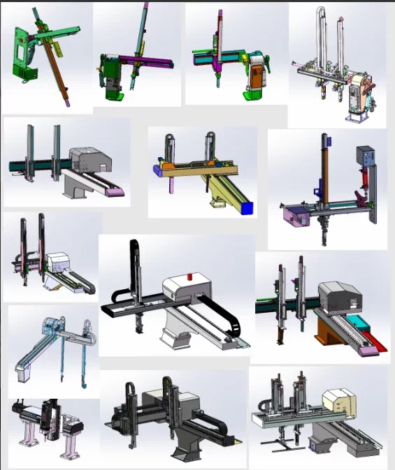
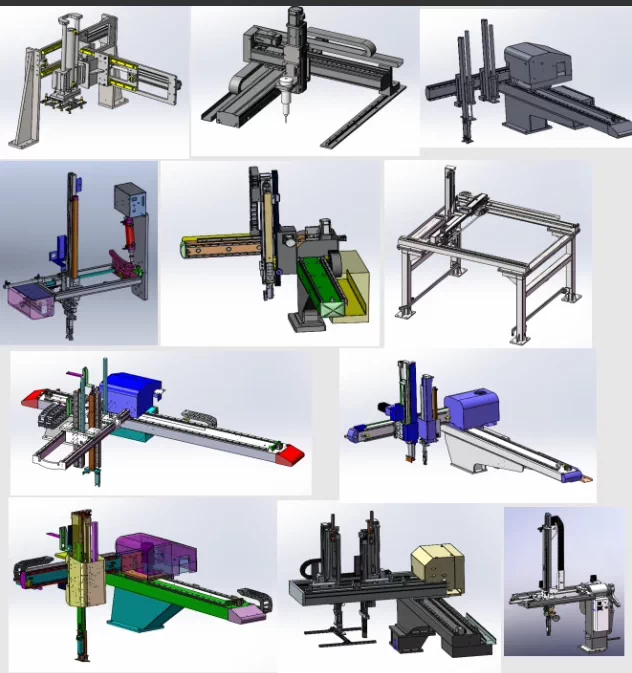
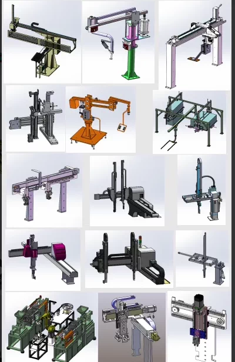

# 73 sets of 3D drawings for mechanical hand transportation, three-axis, four-axis, five-axis servo up and down loading injection molding and stamping mechanical hands.

## Body

73 sets of 3D drawings for 3-axis, 4-axis, and 5-axis servo-controlled robotic arms for handling, loading, unloading, injection molding, and stamping machinery

(Full product description was not available from the source page.)

## Images

## Payment

Here is a pay link on Stripe ( https://buy.stripe.com/3cs8yP7sY87d0vu9AB ). Please contact me lonlonago@foxmail.com after funding $89, and I will send you a complete data files , thank you!

